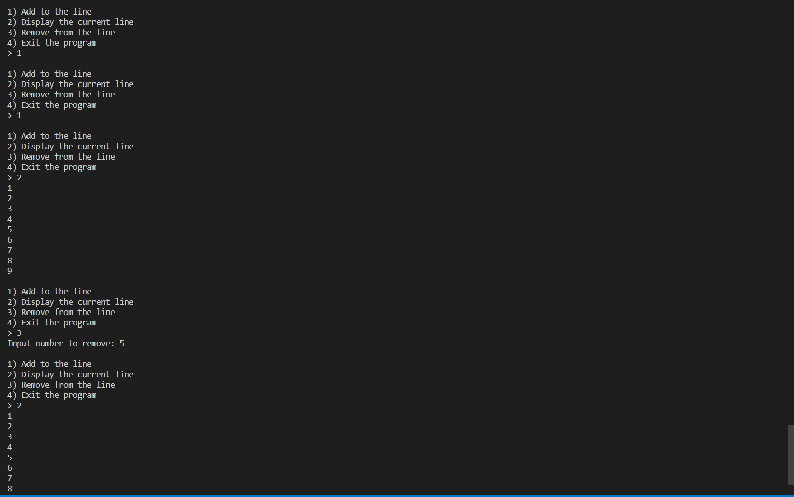

# Description  
This program creates a line of people wating and putting the number in a list. If a number is added to the list, it adds the next number in the line to the back of the list. If a number is removed, it removes the desired number, then changes every number that is after the removed number to maintain the proper flow of the list.

# Setup and Execution
This program was created on Visual Studio Code in the Python Language. Ensure that the Python extension is added by checking the extension tab at the middle of the screen. Once set up, the list will be made starting with only a zero in it. Once the first person is added, it adds the one and removes the zero to start the line.

# Example

# Useful Websites
[w3schools](https://www.w3schools.com/python/default.asp) - contains tutorials for Python.